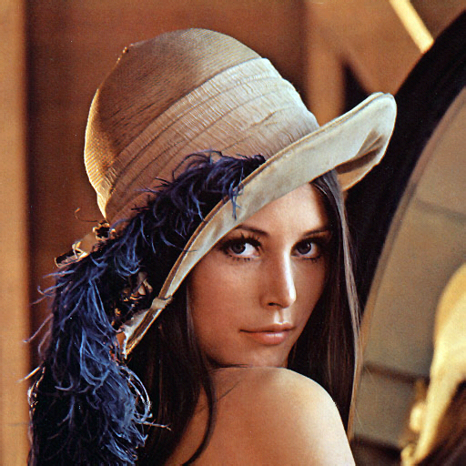
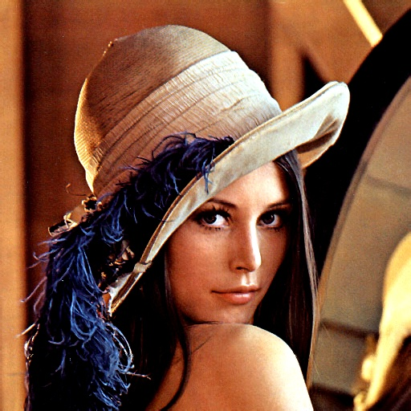
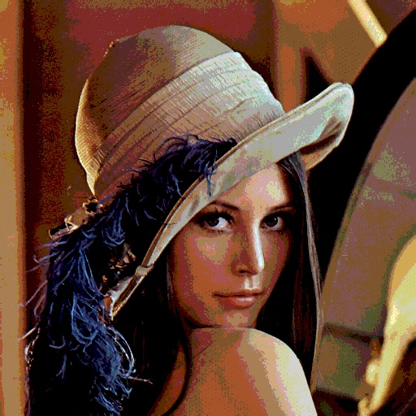
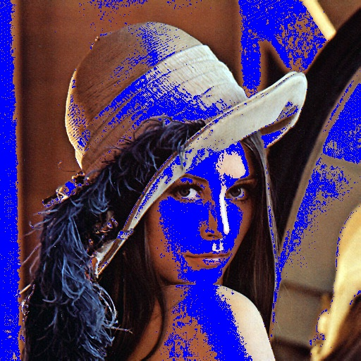
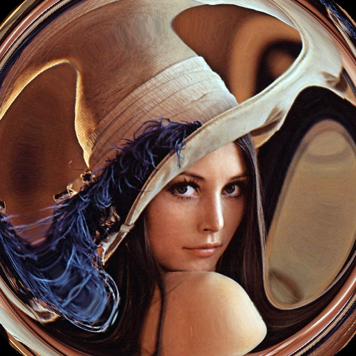

# opencv-fx

Real-time image processing app using OpenCV.

## Features

- **Contrast & Brightness:** Adjust image contrast and brightness.
- **Posterization:** Reduce color resolution for a stylized effect.
- **Blur:** Apply customizable blur to images.
- **Alien Effect:** Replace skin tones with selected colors.
- **Distortion:** Barrel and pincushion distortion effects.
- **Live Camera Feed:** Preview and apply filters in real time.
- **Capture & Save:** Save processed images.

## Filter Examples

| Original | Contrast | Posterization |
|----------|----------|--------------|
|  |  |  |

| Blur | Alien | Distortion |
|------|-------|------------|
|  |  |  |
